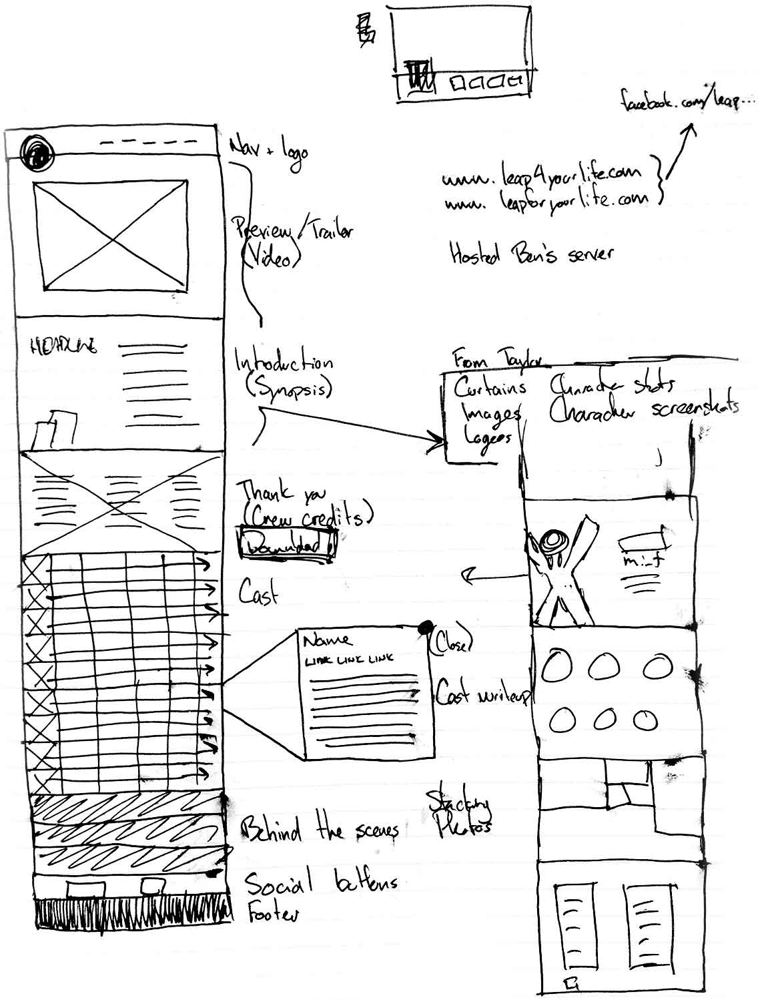
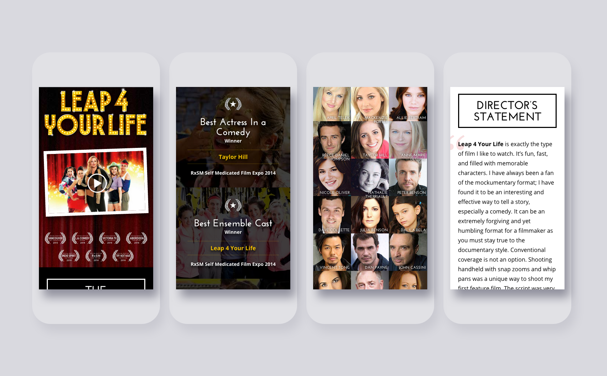
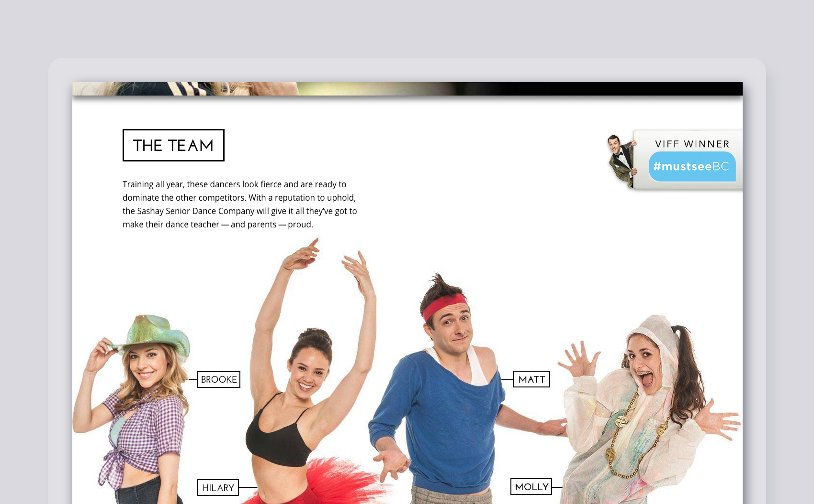
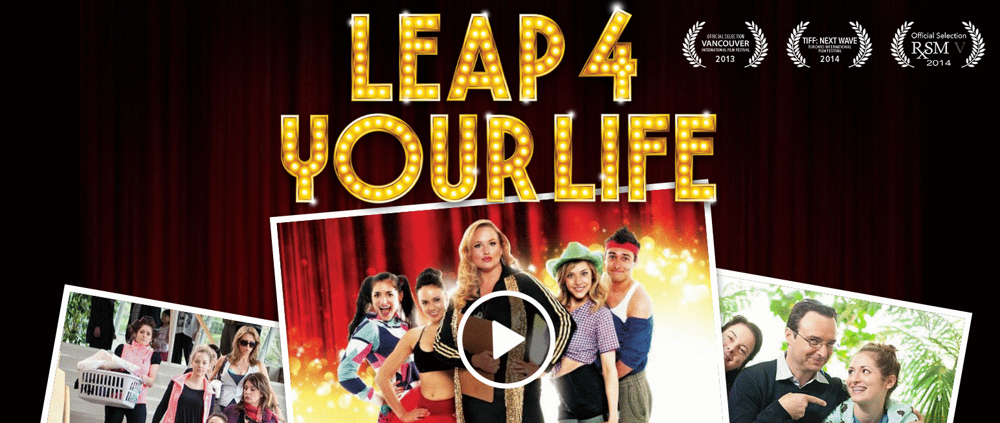
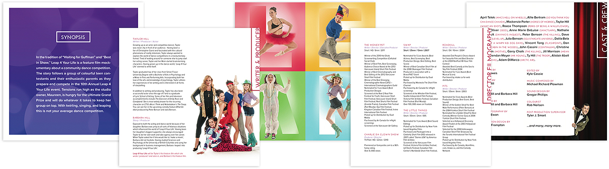
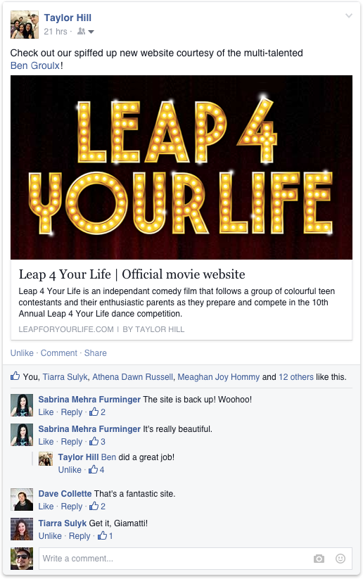

# Feature Film Promotional Website Design & Development

| Client           | Leap 4 Your Life |
| :--------------- | :--- |
| Type             | Web Design / Graphic Design |
| Role             | Lead Designer |
| Responsibilities | User interface (UI) design, Graphic design, Art direction, Front-end development |
| Year             | 2012 |

In the tradition of “Waiting for Guffman” and “Best in Show,” Leap 4 Your Life is a feature film mockumentary about a community dance competition. The story follows a group of colourful teen contestants and their enthusiastic parents as they prepare and compete in the 10th Annual Leap 4 Your Life event. Tensions run high as the studio owner, Maureen, is hungry for the Ultimate Grand Prize and will do whatever it takes to keep her group on top. With twirling, singing, and leaping… this is not your average dance competition.

I was approached in 2012 by [Taylor Hill](https://twitter.com/iamtaylorhill), writer and creator of Leap 4 Your Life. She was looking for help with the design and development for a new site so that she could start establishing a web presence for the film. We talked through the objectives of the website, the mandatory aspects (and the non-mandatory ones, too), and the overall tone of the site. We got to sketching together, tossing around ideas about what we thought would be appropriate — and how it could be achieved.

The end result is a lively, festive visual design that intermingles well with the fun, upbeat written copy. Much of the site’s visual design is enhanced with animation, movement, and effects. None of the animations on the site are mandatory, and are built to accommodate browsers that don’t support them.

Taylor also needed some help creating an electronic press kit (EPK) that could be sent out to producers and studios, so I created a 14-page brochure-style booklet that could be representative of the film. [Download the Leap 4 Your Life EPK](../assets/Leap4YourLife-EPK.pdf) [4.8mb].

***

The *Leap 4 Your Life* work was extremely well received. In the end, Taylor and I managed to pull together a website that was fun and vibrant, but more importantly conveyed the tone of the film and allowed it to start building an online presence based around this “hub.” In 2014, *Leap 4 Your Life* was acquired by Pacific Northwest Pictures, thereby adding the film to its rotation on *Super Channel*. I continue to make updates to the site when required.

> Ben took everything in my head and made it better. His creative vision and organizational skills created a site and EPK package that was both vibrant, easy to use, and innovative. Aside from his obvious talent, his professionalism and easy going personality honestly makes him a dream to work with. If you are looking for a web designer who has a sleek and modern design aesthetic, as well as quick to update any changes — then Ben is your guy. 
**Taylor Hill**
*Leap 4 Your Life*

***

[**Watch more:** In 2015, I directed an episode of *Almost Actors*, a comedy web series created by Bitchpop Productions. This particular episode of *Almost Actors* was titled “The Indirector,” and starred Taylor Hill as the titular character. You can watch the episode on YouTube.](https://youtu.be/18hjQV8Jd6M)
