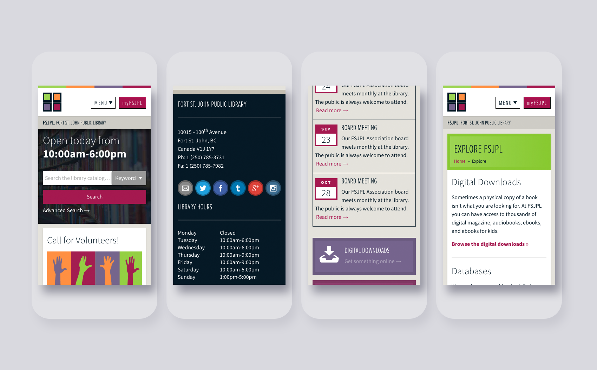
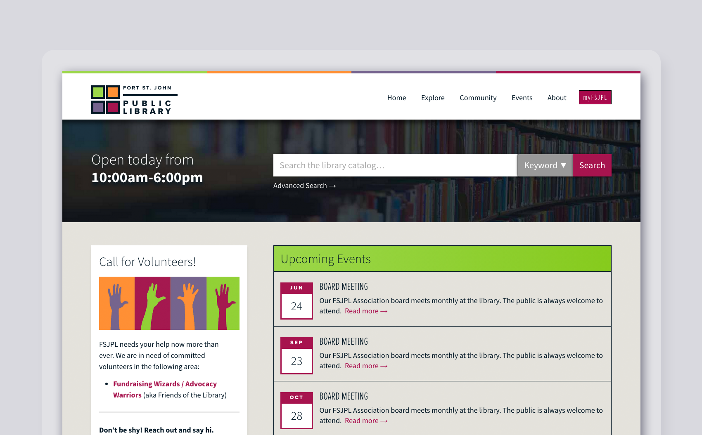

# Fort St. John Public Library

Custom Fit Online is a web design, development, and content marketing shop in Whistler, BC.

| Client           | Fort St. John Public Library |
| :--------------- | :--- |
| Type             | Web Design |
| Role             | Lead Designer |
| Responsibilities | User interface (UI) design, User experience (UX) design, Front-end development |
| Year             | 2014 |

“The Fort St. John and Area Public Library is a community cornerstone, providing a variety of information and support for lifelong learning in a welcoming, entertaining and safe environment. The library hosts creative, community-oriented programs and delivers top-notch customer service.”

That’s what is written on the Fort St. John Public Library website. But what FSJPL really is, is a bold, interesting library doing some pretty cool things. When they contacted us at the end of the summer in 2014 about redesigning their online presence, we were ecstatic to jump on the opportunity to work alongside them.

## In The Beginning…

[Design by committee doesn’t work](https://customfitonline.com/news/2013/8/30/why-design-by-committee-fails/), so we made it clear right from the get-go that there was to be one person of contact making the decisions on behalf of FSJPL. Committees only work if all members of the committee are deeply rooted in the true understanding of their organization, are willing to put aside their own personal preferences for the greater good of the organization’s goals, and can trust the decisions of the designers. It’s very difficult to have a committee adhere to all three. As libraries have boards, and therefore committees, we had to make sure FSJPL understood that a sole decision-maker had to represent its entirety. That person was Kerry, FSJPL’s Library Director, and she was an absolute pleasure and ease to work alongside.

***

[**Read more:** Design by committee, or in other words the reviewing of design by a group, is a process detrimental to the final outcome of a product.](https://customfitonline.com/news/2013/8/30/why-design-by-committee-fails/)

***

There were only a handful of people who worked on this project: Kerry represented the library, [Robert Valcourt](http://customfitonline.com/about/) acted as project manager and back-end developer, [Roy McClean](https://twitter.com/roymcclean) helped out with content and SEO, while I lead all design and front-end development. Some of our other Custom Fit Online team members also helped out with some promotion at the end. The closeness of the team was wonderful, as it allowed us to communicate and move forward in a very efficient manner.

Once contracts were signed, timelines established, and after a couple introductory meetings, everyone was fresh-faced and ready to go. Finally we jumped into a design kickoff.

## Design Kickoff

For our initial design kickoff, I lead Kerry through a series of exercises, the two most noteworthy being the *Gut Reaction Test* and the *Content Priority Test*.

### Exercise 1: Gut Reaction Test

The goal of the gut reaction test is to quickly determine the visual style, and to get insight into it. I have found that when it comes to web design, it is easier for most people to visualize design by comparing and contrasting existing websites. In the Gut Reaction Test, the client is shown various websites for a brief moment, and they are asked to rank them from 1-5 on the following criteria:

* **Gut Feeling**: “How much do you like the visual design and content hierarchy on this site?”
* **Happiness**: “If your new website were to launch with this exact design (layout, colours, fonts, etc.) just with different written content, how happy would you be?”

By spending no more than a few moments (~5-10 seconds) on a handful of existing designs (~30 websites), it allows people to really focus in and spot the immediate items of interest. Sometimes it’s a swash of red, or an interesting navigation configuration or layout… the notes are always different. We can then discuss what is good and what is bad. It’s a fun, interactive exercise that ends up having included everyone in the discussions about design.

### Exercise 2: Content Priority Test

The second major exercise we went through was the Content Priority Test, designed to determine which elements on the page were most important. This was a timed exercise, and required Kerry to dump everything she could possibly think of that would go on to each of the major pages around the site, such as home page, gateway pages, etc. We then worked through the noted items and determined which elements were crucial, which were nice-to-have, and those which were not important. This allowed us to build out a content map, noting which blocks and areas should be displayed first (or at all). This led straight into layout design.

## Bringing Together Layout and Visual Design

Once we had content mapped out, we could begin playing with various iterations of visual design. By using the existing colours of the FSJPL brand and the notes and feedback provided by Kerry, I was able to hone in on a visual language that appropriately identified FSJPL. With a distinctive collection of playful icons, festive colours, and large swashes of imagery and backgrounds, a visual palette was created that could be applied overtop of the content priority design and wireframes.

## Develop for Speed and Iterate Often

Once we had a handle on the visual design language and had our content priority guide in place, I jumped as fast as possible straight into code. I (almost always) go straight to coding, while designing in-browser. Designing by code allows us to see how designs will adapt and adjust to various device sizes and resolutions, making bug-fixing and layout adjustments easier to spot and eradicate.

I received feedback from Kerry as soon as possible, and as often as possible. Getting a continuous stream of feedback and discussion, we were able to iterate often and produce designs that satisfied the library’s goals.

***

[**Read more:** Getting feedback is crucial to the development and wellbeing of all design projects.](https://customfitonline.com/news/2014/10/17/giving-receiving-better-design-feedback/)

***

The site is built on the Umbraco content management system. By using Umbraco we were able to rapidly buildout the designs without worrying too much about how we would be able to accommodate the many requirements of the website, such as an integrated blog and events section, updated hours, image galleries, and more.

## The Final Results

We monitored and analyzed the redesigned FSJPL website via Google Analytics: time-on-site has increased, bounce rate has decreased, and more users have been using the site on mobile devices. We were thrilled to work with the Fort St. John Public Library on their redesign, and the results speak for themselves.

>["Custom Fit Online delivered on their word to create a responsive site which provides a functional and visually appealing experience for our patrons. Clearly skilled in what they do, they made the entire process far less daunting than I had expected. Professional, polished, and painless - this team nailed it.](https://www.customfitonline.com/portfolio/fsjpl/)
**Kerry France**
*FSJPL Director*
