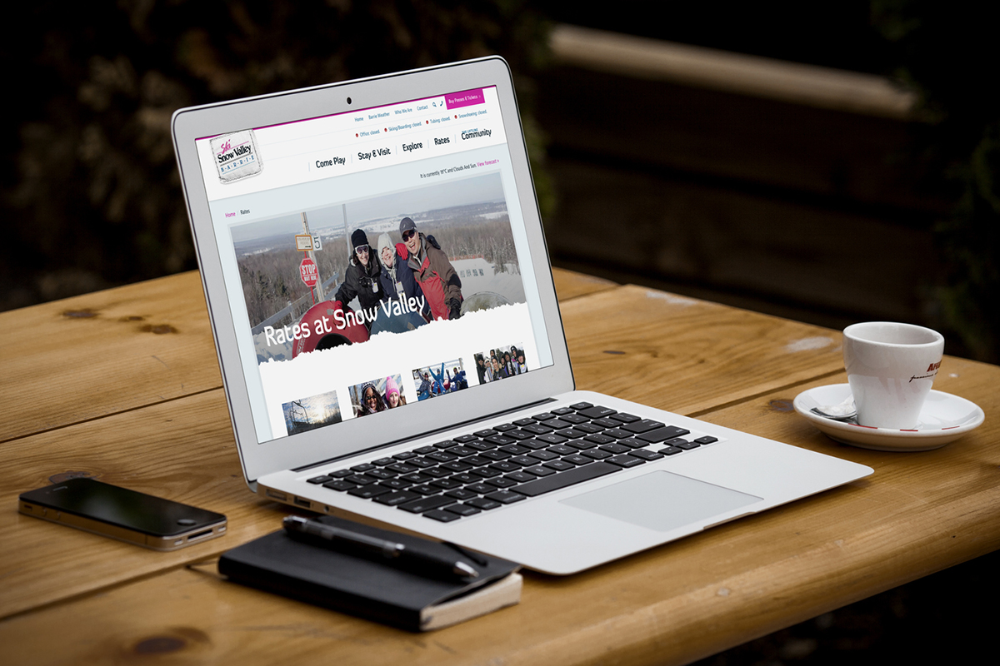
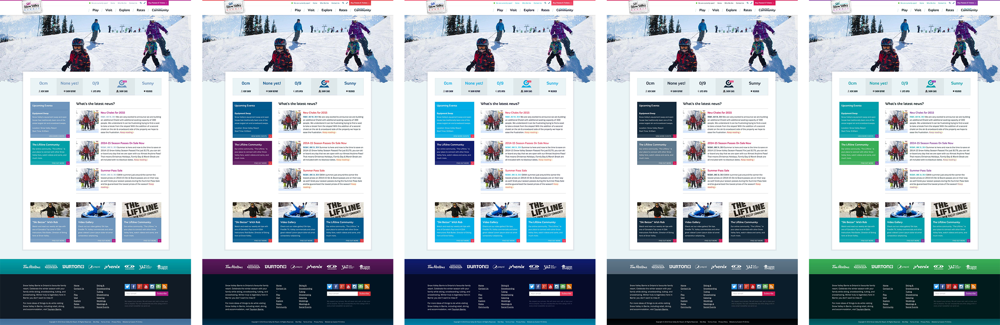
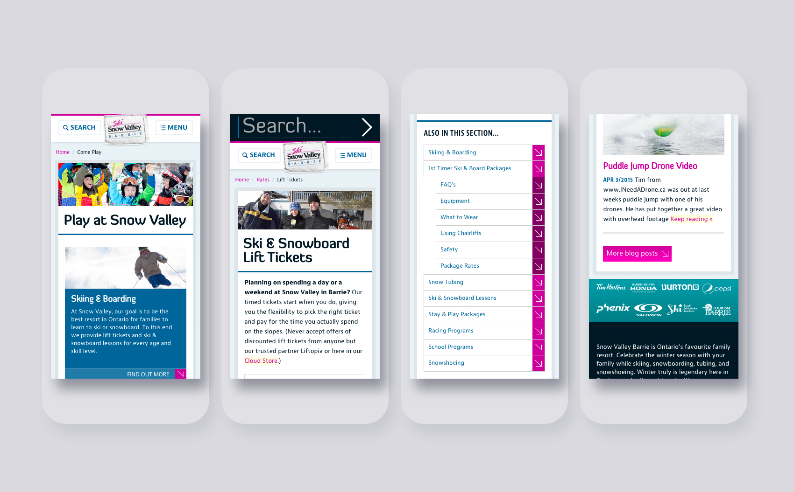
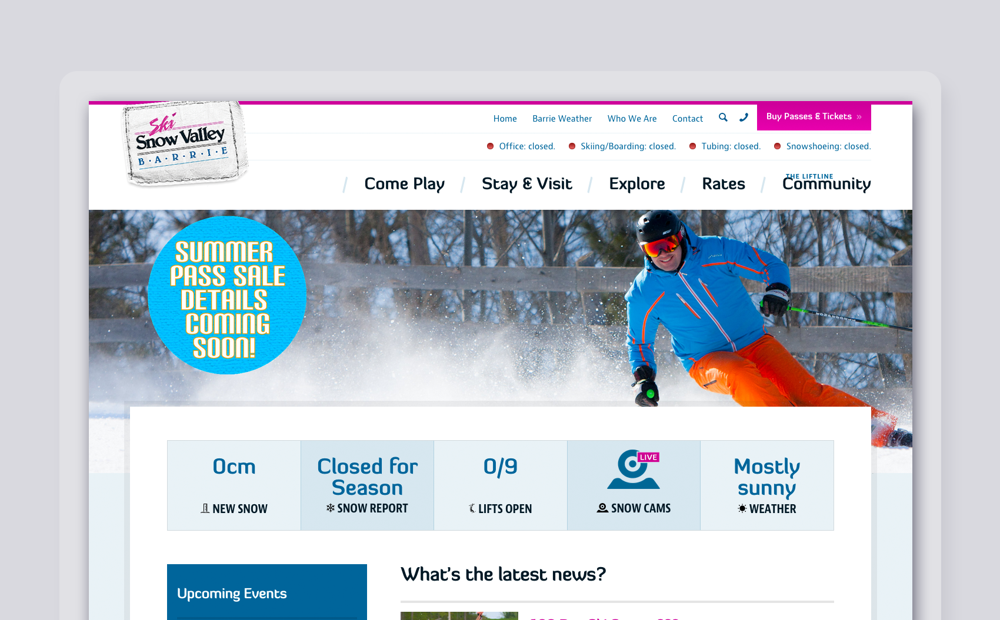

# Ski Resort Website Design & Marketing

| Client           | Snow Valley (Barrie) |
| :--------------- | :--- |
| Type             | Web Design / Ecommerce |
| Role             | Lead Designer |
| Responsibilities | User interface (UI) design, Front-end development |
| Year             | 2014 |

(image: snow-valley-screen.jpg)
(image: snow-valley-colour.jpg caption: )
(image: snow-valley-redesign-mobile.png)
(image: snow-valley-redesign-desktop.png)

>["Custom Fit Online succeeded in re-branding Snow Valley and raising Snow Valley's profile enormously. They have done great work designing and managing Snow Valley's web marketing efforts. Our website traffic is excellent. The website and social media channels bring in significant amounts of revenue to the resort. Plus [t]his team [is] fun to work with!"](https://customfitonline.com/portfolio/snow-valley/)
**Rob Butler**
*Director of Skiing*
