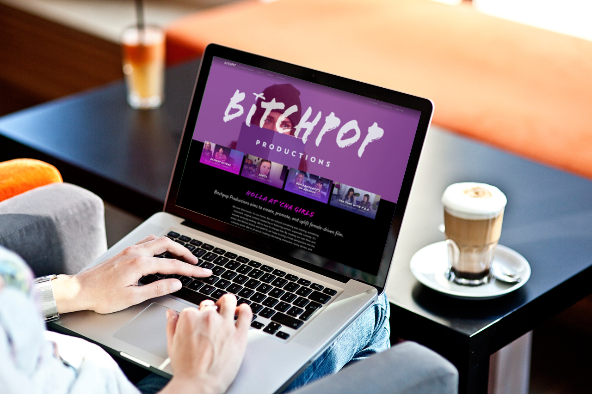
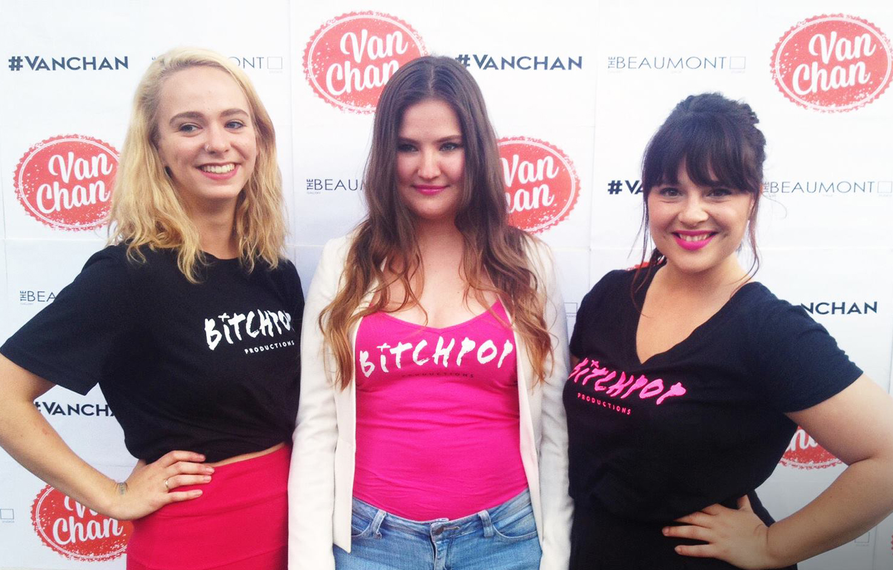
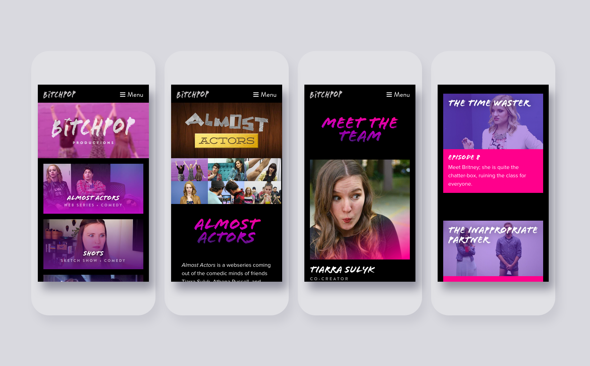
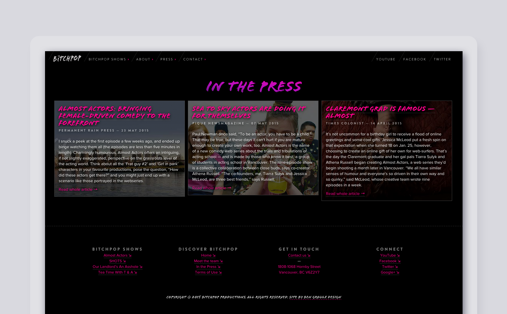
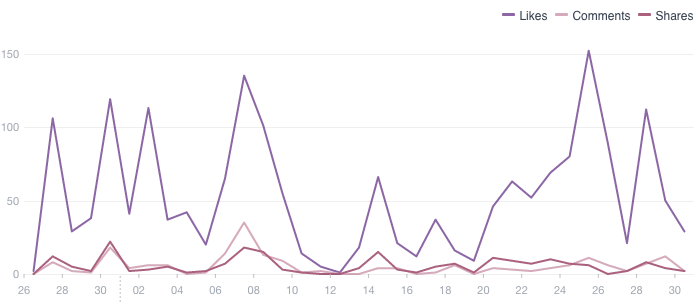
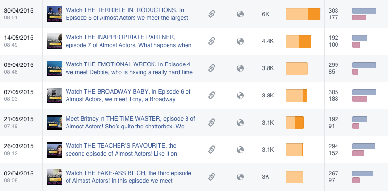
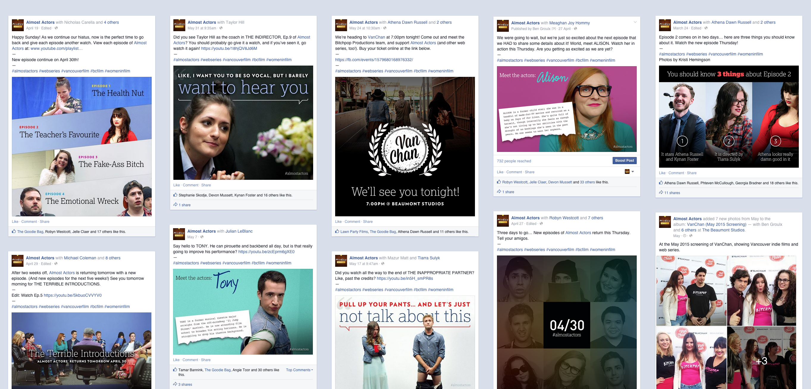
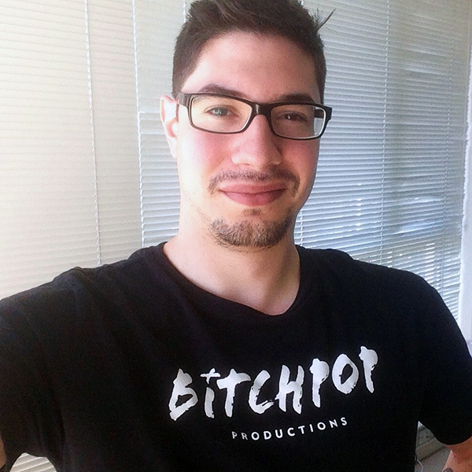

# Production Studio Web Design, Development, & Graphic Design

| Client           | Bitchpop Production |
| :--------------- | :--- |
| Type             | Web Design / Graphic Design / Marketing |
| Role             | Lead Designer |
| Responsibilities | Graphic design, Art direction, Front-end development, Web hosting, Social media, Copywriting |
| Year             | 2015–2016 |

In 2015, [Athena Russell](https://twitter.com/athenadrussell) and [Tiarra Sulyk](https://twitter.com/Teeairah) — friends and creative partners — noticed something was missing from Vancouver, something important: original content created by or featuring women, especially comedy. They note that it’s actually seriously lacking. They’re here to change that. By creating their own films and series they hope to bring a fresh perspective into the comedy world. They’re all about creating interesting characters, funny stories, and unique concepts. 

***

[**Read more:** Feminism is a necessity in film and television, now more than ever. We at Bitchpop Productions are determined to bring female-driven content to the forefront.](https://facebook.com/photo.php?fbid=10206696245395259&set=a.1309946799233.2045215.1547511811)

***

I worked alongside Tiarra and Athena to help clarify the voice and tone of Bitchpop, and figure out exactly how best to tell their stories. It’s their goal to make Bitchpop a hub for film. “Hey, did you see that video on Bitchpop last night?” is what they want their audience to say.

The three of us created a visual identity for Bitchpop that was a little edgy, a little rugged, and totally trendy. No unnecessary icons or imagery, just one straight to the point, in your face word: BITCHPOP. This logo works great on almost all mediums; we’ve stuck it on bags, hats, shirts, stickers, posters, videos… it works everywhere, and there’s no question about the visual brand: Bitchpop is here to make an impact.

The website I designed and developed launched in May 2015. The focus was to promote each of the Bitchpop properties. I worked through several iterations. Because I had clear brand guidelines established, adding a “skin” on top of various wireframes proved easy. We worked through several wireframes before we all agreed upon the final design.

The first production Bitchpop is responsible for is *Almost Actors*, a comedic web series about acting school. The series was met with near universal acclaim and positive feedback. I helped out with the videos themselves behind the camera as film editor and title card creator, and ran their social media campaigns.

Our Facebook campaign, in particular, was especially successful. Every week that an episode was posted, I created graphics of character breakdowns, quotes, and behind-the-scenes shots that related to the particular episode. On average, posts were garnering 15–20% of our total page likes, which is quite strong for Facebook.

> [Ben was able to bring our exact vision to life through his design work. He had some really awesome ideas, and we are thrilled with the way the Bitchpop brand is leaping to life.](https://linkedin.com/in/bengroulx/#recommendations)
** Tiarra Sulyk **
*Co-Creator, Bitchpop Productions*

In May 2015, I came on board Bitchpop as Operations Manager; my role is to alleviate the load off of the co-creators shoulders, leaving them to the hand-shaking and idea creation. I’m proud to work alongside these incredibly dynamic and driven women, creating content that is amusing, funny, and important. I wear my Bitchpop t-shirt every other day and bring up the subject whenever I can. We are continuing to create new content; I hope you will give our videos a watch and support our concept.
