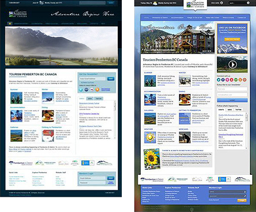
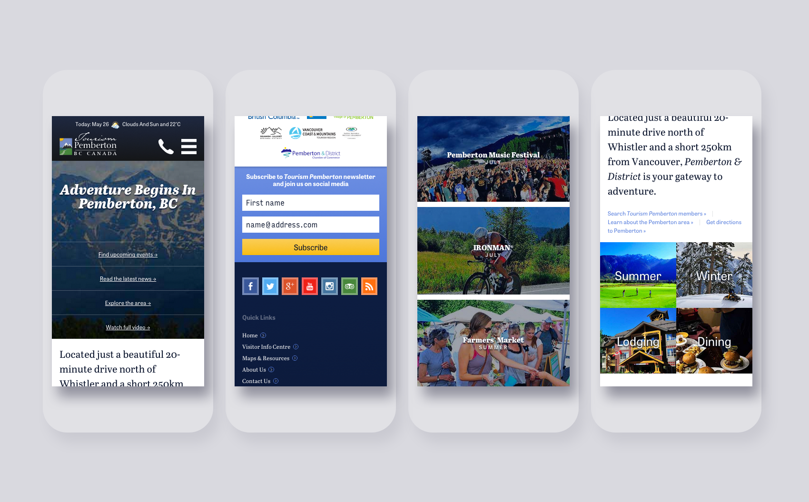
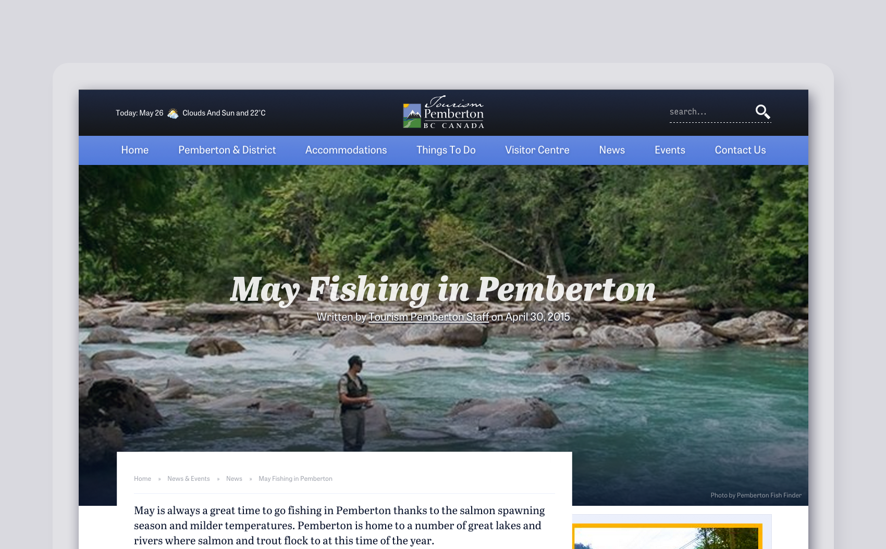
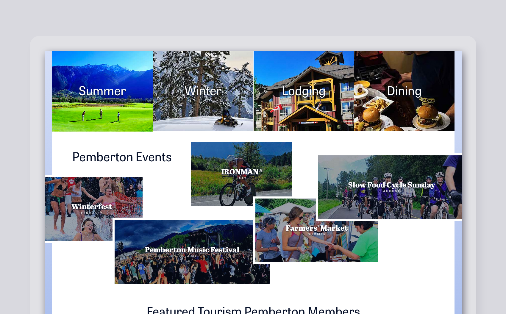

# Tourism Org Web Design & Development

| Client           | Tourism Pemberton |
| :--------------- | :--- |
| Type             | Web Design / Graphic Design / Marketing |
| Role             | Lead Designer |
| Responsibilities | User interface (UI) design, Front-end development, Copywriting |
| Year             | 2015 |

*Adventure Begins In Pemberton, BC!* That’s Tourism Pemberton’s slogan — and for once it’s a tagline that isn’t hyperbolized. The small town of Pemberton, with a population of about 3,000, is home to some incredible activities and adventures.

Several years ago, when I was in my first couple months with [Custom Fit Online](http://customfitonline.com), I was tasked with “re-skinning” the Tourism Pemberton website. It was nothing more than a cosmetic overall that went from drab, to, well, not quite as drab, but that was all the budget Tourism Pemberton could spend at that time. The work we did brightened up the site and improved it visually quite a bit, but it still needed a proper redesign. So it was at that point I decided to take it upon myself to kickstart that process, even if I wasn’t getting paid for it. It was my intention to present Tourism Pemberton with research and design so that they would consider taking the plunge.

Time passed, and I had to set my sights on more pressing matters — paid ones. Then, in early 2015, Tourism Pemberton finally came around to the idea of a redesign after we had made it abundantly clear a responsive website was necessary for them to see continued success with their web presence. And not just a reskin this time: a fresh slate. You can imagine my joy. I set to work updating my previous work — a lot of which still held up three years later.

Tourism Pemberton has wonderful written and organized content, and the way that it was implemented into Umbraco, their CMS, made it easy to pick bits and pieces and apply them to the new designs.

Pemberton is such a beautiful location, and we were lucky to have access to so much lovely photography. I really wanted to push this, and let the photos speak as loudly as they could. By combining natural photography with bits of well thought-out typography, the Pemberton story is immediately told to site visitors.

While there were many site-wide changes that happened, the most drastic changes occurred on the home page because we entirely shifted its focus. After doing some user and demographic research, we honed in and focused on what are the things that attract people to Pemberton. We determined four major categories — summer, winter, dining, accommodations — and events to be the most important.

> [Ben is part of the creative team at Custom Fit Online that recently launched a revamp of [the Tourism Pemberton] website that brought a fresh new look and functionality that has helped drive more bookings to the hotel.](https://linkedin.com/in/bengroulx/#recommendations)
**David MacKenzie**
*Owner/General Manager Pemberton Valley Lodge*
