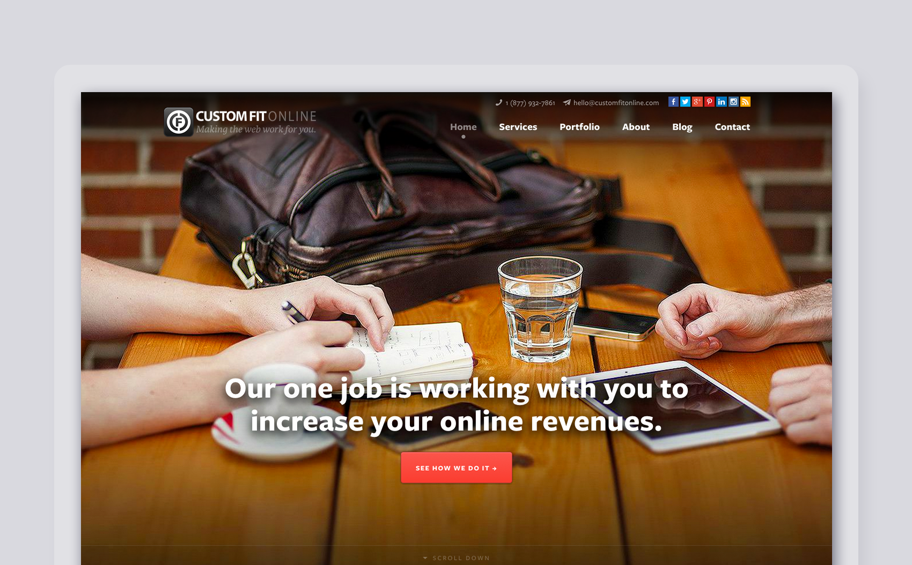

# Custom Fit Online

Custom Fit Online is a web design, development, and content marketing shop in Whistler, BC.

| Client           | Custom Fit Online |
| :--------------- | :--- |
| Type             | Web Design / Graphic Design / Marketing |
| Role             | Lead Designer |
| Responsibilities | User interface (UI) design, User experience (UX) design, Graphic design, Art direction, Front-end development, Social media, Copywriting |
| Year             | 2013 |

>[Ben is a very special guy. He is a very talented designer, writes well,“gets” marketing and design, has a great passion for his work… and most importantly he is a really good person. We are thrilled with Ben’s design work. And he consistently contributes great ideas and concepts for our clients and the company. I highly endorse Ben.](https://linkedin.com/in/bengroulx/#recommendations)
**Roy McClean**
*Co-Worker / Owner & Managing Partner*

>[The things Ben excels at include the most important things: His integrity, sense of empathy and connection to clients/co-workers and leadership ability flow through his relationships. Those are key. His talent, which becomes all the more apparent when he reaches out to share his knowledge and discuss design, is top notch. I have recommended Ben several times and will continue to do so.](https://linkedin.com/in/bengroulx/#recommendations)
**Wendy Kelly**
*Co-Worker / Content Strategist*

>[I worked with Ben at Custom Fit Online and even though we worked together virtually, we had great chemistry. He was always able to execute my ideas into beautiful graphics, teach me how to do technical things that I didn't know how to do and was always really positive. He's a talented man and if you get a chance to work with him you will see first hand.](https://linkedin.com/in/bengroulx/#recommendations)
**Blair Kaplan**
*Co-Worker / Communications Specialist*
