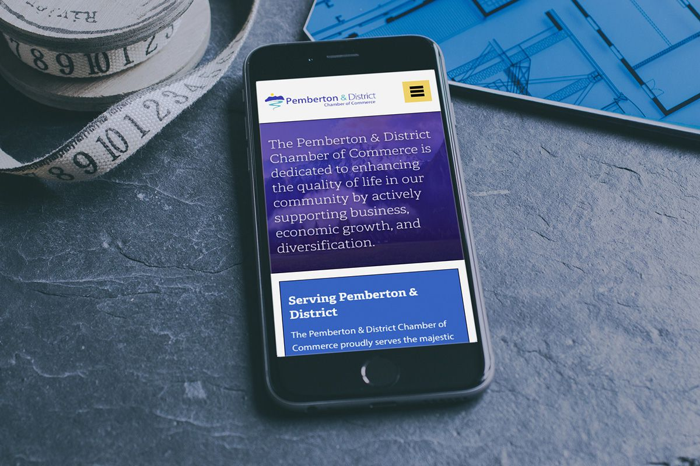
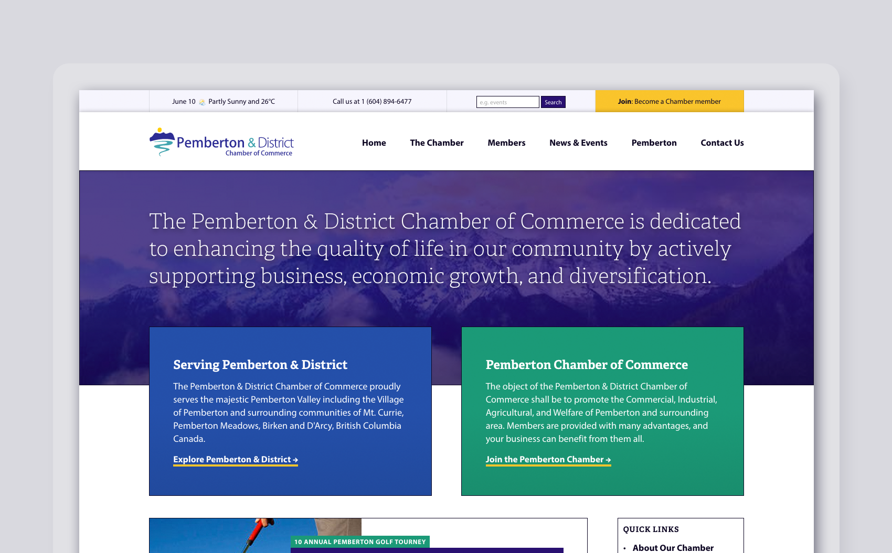
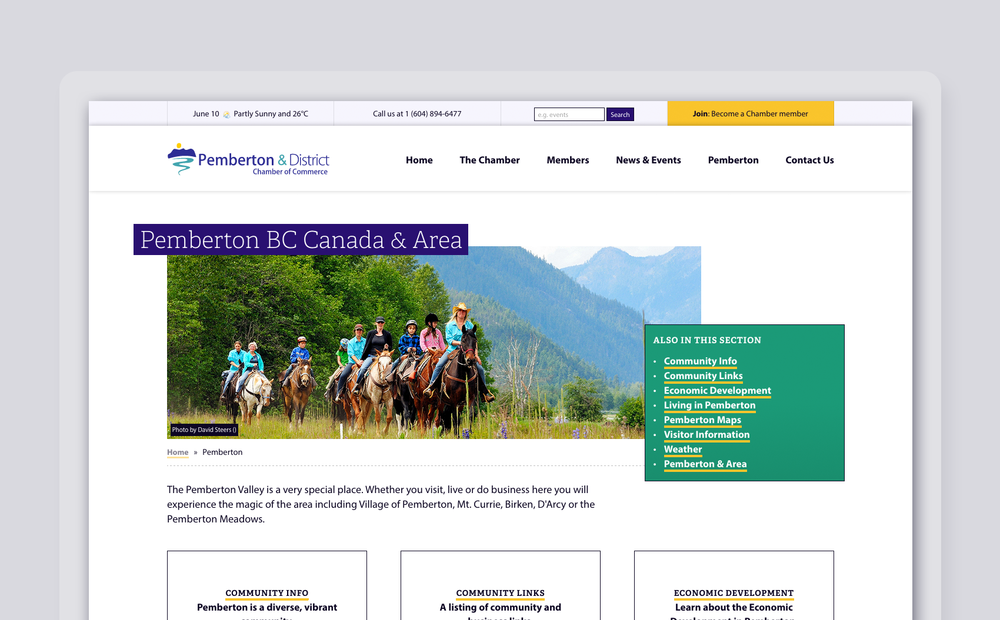
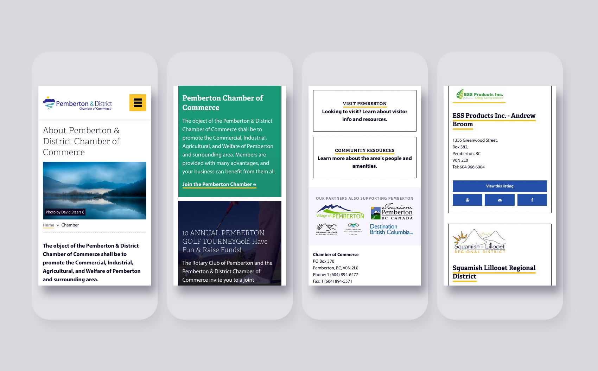

# Pemberton Chamber of Commerce

In late 2014, Custom Fit Online was tasked with bringing a fresh new design perspective to the Pemberton Chamber of Commerce.

| Client           | Pemberton Chamber of Commerce |
| :--------------- | :--- |
| Type             | Web Design |
| Role             | Lead Designer |
| Responsibilities | User interface (UI) design, Front-end development |
| Year             | 2013 |

While we would have liked to spend some time with the community, learning about how users used the website, it simply was not feasible in this instance. What we did have, though,  was access to all the data in the world. And while having data is nice, making sense of those numbers is incredibly hard. It’s easy to be sidetracked and to make assumptions. Luckily, Roy McClean truly is an expert when is comes to analytics, and together we created a new website for PCC that was beautiful and made sense — and cents.

The chamber website is chock-full of information for members, so getting that information into priority was, well, our priority. The visual design of the website makes it clear how to navigate through the website, and brings forward valuable information right away. Because content is what really matters. 

But that doesn’t mean there isn’t room to make it beautiful! I spent several days working through new colour palettes that evoked the Pemberton mood, but still maintained the professionalism that is to be expected from a chamber of commerce. The result is fun, vibrant, and still serious.

